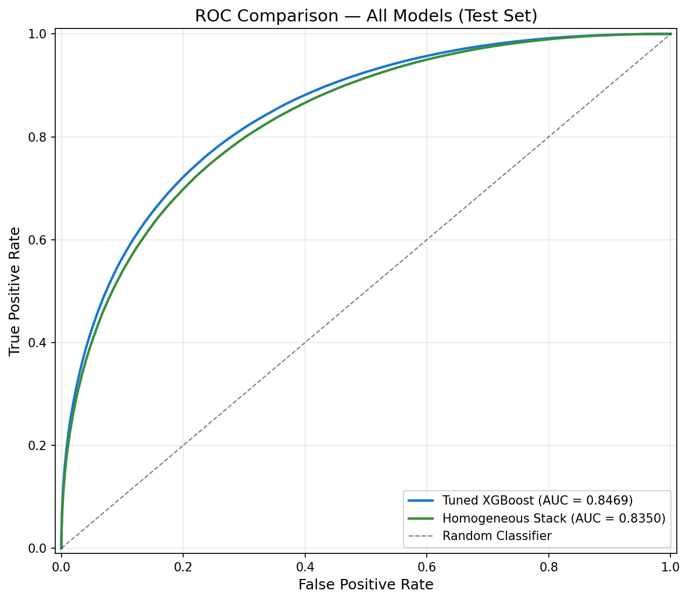
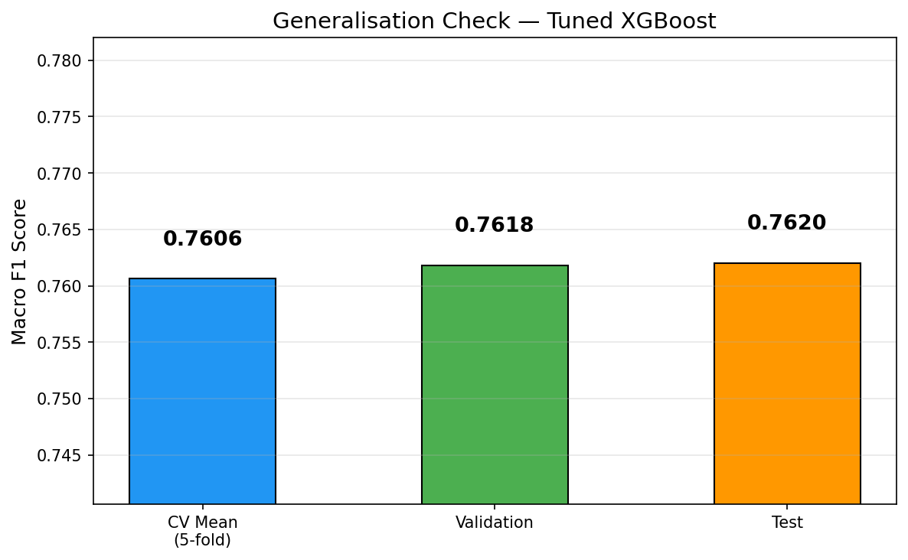

# GPU-Accelerated Higgs Boson Classification

Separating Higgs boson signal events from background noise across **11 million simulated LHC collisions**, using the NVIDIA RAPIDS stack (cuDF, cuML, CuPy) and GPU XGBoost.

The tuned XGBoost model reaches a **macro F1 of 0.762** and **ROC AUC of 0.847** on a held-out test set of 1.65M events. On the GPU, inference runs **7× faster** and data loading **3.9× faster** than on the CPU.

<p align="center">
  
  
</p>

---

## Results

### Test set (1,650,000 events, evaluated once)

| Model | Macro F1 | Precision | Recall | ROC AUC |
|---|---|---|---|---|
| **Tuned XGBoost** | **0.7620** | **0.7626** | **0.7617** | **0.8469** |
| Homogeneous stack (2× XGBoost → LR meta) | 0.7509 | 0.7514 | 0.7506 | 0.8350 |

- **Accuracy:** 0.7632
- **Average precision:** 0.8604
- **Signal recall (TPR):** 78.8%
- **Background rejection (TNR):** 73.6%

### Generalisation

| Stage | Macro F1 |
|---|---|
| 5-fold CV (train) | 0.7606 ± 0.0002 |
| Validation | 0.7618 |
| Test | 0.7620 |

The CV, validation and test scores are within 0.0014 of each other, so the model shows no sign of overfitting. The best decision threshold (0.51) improves F1 by only 0.0002 over the default of 0.5.

### Validation-set model comparison

| Model | Val F1 | Train time |
|---|---|---|
| XGBoost baseline (200k sample) | 0.7168 | 5.7 s |
| cuML Random Forest (100 trees, depth 16) | 0.7102 | 53.9 s |
| XGBoost initial (7.7M rows, `gpu_hist`) | 0.7493 | 29.6 s |
| Heterogeneous stack (XGB + cuML RF + cuML LR → LR meta) | 0.7449 | — |
| Homogeneous stack (2× XGBoost → cuML LR meta) | 0.7524 | — |
| **XGBoost tuned (random search)** | **0.7618** | 116.5 s |

### CPU vs GPU

Hardware: NVIDIA Quadro RTX 8000 (48 GB) and Intel Core i9-9900K.

| Operation | CPU | GPU | Speedup |
|---|---|---|---|
| Load 11M-row CSV (pandas vs cuDF) | 49.63 s | 12.78 s | **3.9×** |
| XGBoost inference, 1.65M rows | 6.59 s (0.25M rows/s) | 0.94 s (1.75M rows/s) | **7.0×** |

The CPU and GPU produce identical predictions.

---

## Dataset

[**HIGGS**](https://archive.ics.uci.edu/dataset/280/higgs) is from the UCI Machine Learning Repository (Baldi, Sadowski & Whiteson, 2014).

- 11,000,000 Monte Carlo–simulated events, about 7 GB of CSV
- Binary label: signal (1) = 53.0%, background (0) = 47.0%
- 28 features:
  - **21 low-level:** raw detector measurements, namely lepton and jet pT, η, φ, b-tag scores, and missing energy
  - **7 high-level:** invariant masses derived by physicists (`m_jj`, `m_jjj`, `m_lv`, `m_jlv`, `m_bb`, `m_wbb`, `m_wwbb`)

The data has no missing values. It contains 278,698 duplicate rows (2.5%), which were kept because each row is an independent collision event.

---

## Pipeline

The project has three notebooks, meant to be run in order. Each notebook reads its inputs from source data or saved artefacts, so none of them relies on in-memory state from another.

### 1. `DataAnalysis.ipynb`: EDA and feature selection

- GPU loading with cuDF and memory profiling, with pandas as the CPU baseline
- Descriptive statistics, data quality checks and class balance
- Univariate, class-conditional and correlation analysis
- Three-stage feature selection:
  1. **Variance threshold (< 0.01):** removed nothing
  2. **Correlation filter (|r| ≥ 0.8):** dropped `m_wwbb` (r = 0.896 with `m_wbb`)
  3. **Random Forest Gini importance:** 90% and 95% importance subsets, plus a high-level-only subset, all scored about 3 F1 points *below* the full set, so all **27 features** were kept
- Initial comparison of Random Forest and XGBoost, which selected XGBoost as the primary model family

### 2. `ModelTraining.ipynb`: training, tuning and stacking

- Stratified **70/15/15** split: 7.7M training, 1.65M validation and 1.65M test rows. The test set stays locked until notebook 3.
- `StandardScaler` fitted on the training split only
- Full-scale XGBoost with `tree_method="gpu_hist"` and early stopping
- Random search over 12 hyperparameter configurations, scored on the validation set
- cuML Random Forest as a comparison model
- Two stacking ensembles built from 5-fold out-of-fold meta-features, each with a cuML Logistic Regression meta-learner:
  - **Homogeneous:** shallow and medium XGBoost base models
  - **Heterogeneous:** XGBoost, cuML RF and cuML LR base models
- 5-fold stratified cross-validation of the best model
- All models, scalers and data splits saved to `artefacts/`

**Best hyperparameters:** `max_depth=12`, `learning_rate=0.05`, `n_estimators=800`, `subsample=0.7`, `colsample_bytree=0.9`, `min_child_weight=5`, `gamma=0.0`, `reg_lambda=1.0`

### 3. `ModelEvaluation.ipynb`: test-set evaluation

- A single evaluation pass on the locked test set
- Classification report, confusion matrix, ROC and precision-recall curves
- XGBoost feature importance by gain, weight and cover. `m_bb`, the b-jet pair mass that stands in for H→bb̄, dominates.
- Error analysis: confidence of misclassified events and the feature regions where errors occur
- Threshold sensitivity (observational only) and a multi-model ROC comparison
- CPU vs GPU inference benchmark

---

## Repository structure

```
.
├── DataAnalysis.ipynb        # EDA, data quality, feature selection
├── ModelTraining.ipynb       # Split, train, tune, stack, cross-validate, serialise
├── ModelEvaluation.ipynb     # Locked test-set evaluation and benchmarks
├── artefacts/                # Saved models, scalers, splits and result CSVs
│   ├── best_model.json       #   Tuned XGBoost (native format)
│   ├── base_models/          #   Stacking base models
│   ├── meta_model.joblib     #   Stacking meta-learner
│   ├── scaler.joblib         #   StandardScaler (fitted on train only)
│   ├── feature_list.pkl      #   27 selected features
│   ├── model_comparison.csv  #   Validation results
│   ├── tuning_results.csv    #   Random search trials
│   ├── cv_results.csv        #   Per-fold CV scores
│   └── test_results.csv      #   Final test-set results
└── plots/                    # All figures produced by the notebooks
```

---

## Getting started

### Requirements

- An NVIDIA GPU with CUDA support. The project was developed on a 48 GB Quadro RTX 8000. The full 11M-row dataset needs about 2.4 GB of VRAM once loaded, and training uses considerably more.
- **RAPIDS 23.08** (cuDF, cuML), CuPy 12.2, Python 3.9
- XGBoost with GPU support, scikit-learn, pandas 1.5, NumPy 1.24, matplotlib, joblib

The easiest way to get a matching environment is the RAPIDS conda install or Docker image. See the [RAPIDS install guide](https://docs.rapids.ai/install).

```bash
conda create -n rapids-23.08 -c rapidsai -c conda-forge -c nvidia \
    rapids=23.08 python=3.9 cuda-version=11.8 xgboost scikit-learn matplotlib joblib
conda activate rapids-23.08
```

### Data

1. Download `HIGGS.csv.gz` from the [UCI repository](https://archive.ics.uci.edu/dataset/280/higgs) and decompress it.
2. The notebooks read the file from `DATA_PATH = "Partical.csv"`. Either rename the file to `Partical.csv` and place it in the project root, or change `DATA_PATH` at the top of each notebook.

### Run

Run the notebooks in order:

```
DataAnalysis.ipynb  →  ModelTraining.ipynb  →  ModelEvaluation.ipynb
```

`ModelTraining.ipynb` regenerates everything in `artefacts/`, including the large model and data-split files that are not stored in this repository.

---

## Known issues and limitations

- **RAPIDS 23.08 quirks:**
  - The cuML `RandomForestClassifier` does not expose `feature_importances_`, so importances come from a scikit-learn RF fitted on the same sample.
  - cuDF `.corr()` caused CUDA context errors, so correlation was computed on a 100k-row sample.
- **Missing test-set results:**
  - The standalone cuML Random Forest was not saved, so it has no test-set score.
  - The heterogeneous stack's artefacts were not saved after a kernel crash, so it was evaluated on validation data only.
- **Room for improvement:** the model still lets through 26.4% of background events (FPR), and about 17% of false positives are high-confidence. Physics-motivated features, deep networks and cost-sensitive thresholds are all worth exploring. Baldi et al. report an AUC of about 0.88 with deep neural networks.

---

## Reference

> P. Baldi, P. Sadowski, and D. Whiteson. *Searching for Exotic Particles in High-Energy Physics with Deep Learning.* Nature Communications 5, 4308 (2014). [doi:10.1038/ncomms5308](https://doi.org/10.1038/ncomms5308)

Developed as coursework for an Accelerated Machine Learning module.
